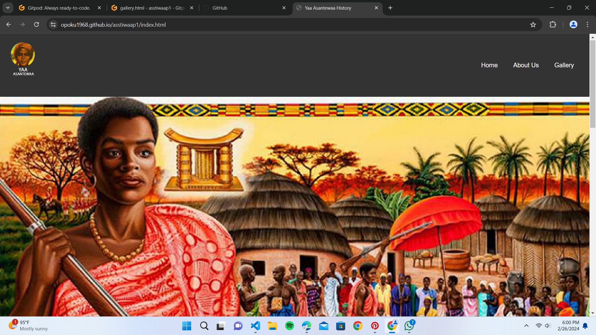
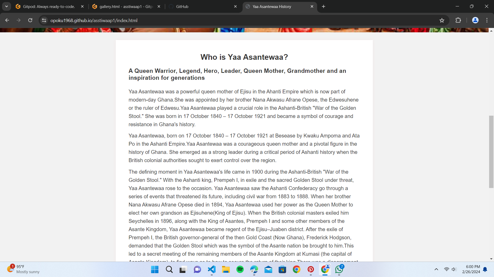

# Yaa Asantewaa History

The Yaa Asantewaa History website is dedicated to preserving and sharing the remarkable story of Yaa Asantewaa, a prominent figure in the Ashanti Empire's history. Born in 1840, Yaa Asantewaa played a pivotal role in the Ashanti-British "War of the Golden Stool," demonstrating exceptional courage and leadership. This website aims to educate and inspire visitors about her life, contributions, and the historical context in which she lived.

## Features

### Existing Features

- **Navigation Bar**
  - Featured on all pages, the responsive navigation bar facilitates easy navigation to the Home, Gallery, and About Us pages.
  - Consistent across all pages for a seamless user experience.

### Home

- The Home Page gives a detailed account of the life and Legacy of Nana Yaa Asantewaa 

### Gallery

- A gallery featuring images related to Yaa Asantewaa allows users to visually connect with the historical context of her life.

### About Page

- This page gives a summarised biography of the great Ashanti Female Warrior Yaa Asantewaa

### Footer

- The footer includes the copyright information.

## Testing

The Yaa Asantewaa History website has undergone thorough testing to ensure functionality, responsiveness, and a positive user experience.

### Features Testing

#### Navigation Bar

- **Expected:** Navigation bar links should direct users to the corresponding pages.
- **Result:** All navigation links are functional and lead to the correct pages.

#### Home 

- **Expected:** Detailed information about Yaa Asantewaa's life should be presented clearly.
- **Result:** The content provides a comprehensive overview of Yaa Asantewaa's life.

#### About 

- **Expected:** Summarised information about Yaa Asantewaa's life should be presented clearly.
- **Result:** The content is well-organized, providing a comprehensive overview of Yaa Asantewaa's life.

#### More Info Section

- **Expected:** External links in the "More Info" section should open in a new tab.
- **Result:** External links open in new tabs, providing additional resources for users.

#### Gallery

- **Expected:** Images in the gallery should load correctly, giving users a visual representation of Yaa Asantewaa's history.
- **Result:** Gallery images load seamlessly, enhancing the user's understanding of historical events.

#### Footer

- **Expected:** Display copyright information
- **Result:** Footer shows copyright info as expected

### Responsiveness Testing

The website has been tested on various devices and screen sizes to ensure a consistent and engaging experience.

- **Desktop:** The site displays well on desktop browsers, providing a visually appealing layout.
- **Tablet:** Responsive design adapts to tablet screens, maintaining readability and navigation ease.
- **Mobile:** The site is mobile-friendly, with content adjusting appropriately for smaller screens.

### Browser Compatibility Testing

The Yaa Asantewaa History website has been tested on different browsers to ensure compatibility.

- **Chrome:** The website functions seamlessly on the Chrome browser.
- **Firefox:** All features work as intended on the Firefox browser.
- **Safari:** The site maintains functionality and appearance on Safari.
- **Edge:** Compatibility is ensured for Microsoft Edge users.

### Validator Testing

#### HTML

- **Result:** Passed W3C validator without errors.
[W3C validator](https://validator.w3.org/nu/?doc=https%3A%2F%2Fopoku1968.github.io%2Fasstiwaap1%2Findex.html)

#### CSS

- **Result:** Passed Jigsaw validator without errors.
[Jigsaw validator](https://jigsaw.w3.org/css-validator/validator?uri=https%3A%2F%2Fopoku1968.github.io%2Fasstiwaap1%2Findex.html&profile=css3svg&usermedium=all&warning=1&vextwarning=&lang=en)

### Unresolved Issues

No significant bugs or issues were identified during testing. The website performs optimally across various platforms and browsers.

### Screenshots of finished Project
-6.png>)

## Deployment

The Yaa Asantewaa History website is deployed on GitHub Pages. Below are the steps taken to deploy the project:

1. **GitHub Repository:**
   - The project is hosted on a GitHub repository.

2. **Settings Tab:**
   - Navigate to the "Settings" tab within the GitHub repository.

3. **Source Selection:**
   - In the "Settings" tab, locate the "GitHub Pages" section.

4. **Branch Selection:**
   - From the "Source" drop-down menu, select the `main` branch.

5. **Automatic Refresh:**
   - Once the `main` branch is selected, the page will be automatically refreshed.

6. **Verification:**
   - A detailed ribbon display at the top of the repository page indicates the successful deployment.

7. **Access the Live Site:**
   - The live site is accessible at the following URL: [Yaa Asantewaa History](https://opoku1968.github.io/asstiwaap1/index.html).

## Credits

### Content

- The historical information about Yaa Asantewaa presented on the website is derived from various historical records, including academic publications, articles, and reputable online sources. The primary goal is to provide an accurate and well-researched account of Yaa Asantewaa's life and contributions.

  - References:
    - [GhanaWeb - Yaa Asantewaa](https://www.ghanaweb.com/person/Yaa-Asantewaa-175)
    - [Wikipedia - Yaa Asantewaa](https://en.wikipedia.org/wiki/Yaa_Asantewaa)

- The direct quotes attributed to Yaa Asantewaa during the Ashanti-British "War of the Golden Stool" are based on historical records and documented speeches from that period.
    - References:
        - [Wikipedia - Yaa Asantewaa](https://en.wikipedia.org/wiki/Yaa_Asantewaa)

- The content on the website has been written and compiled by Kofi Opoku (Me), the author and developer of this project.

### Media

- The images used in this project, including the logo, slider image, and historical photographs, are sourced from open-access repositories, historical archives, and public domain collections. The goal is to respect copyright and use images that are freely available for public use.

- The slider image ("assets/images/yaa_slider.jpg") is sourced from Google Images.
- Yaa Asantewaa video is sourced from Lindsay Holiday's youtube documentary of Yaa Asantewaa [Youtube - Yaa Asantewaa](https://www.youtube.com/watch?v=D7f8rCIQrlo)

- The logo image ("assets/images/logo.png")  sourced from Google Images.

- Historical photographs used in the content are credited to their respective sources, which may include historical archives, museums, or online repositories.

### Code and Implementation

- The website layout and styling are based on custom code created by Kofi Opoku (ME). The CSS styles, HTML structure, and interactive features are original work for this project.

- Inspiration for responsive design and navigation implementation was drawn from various online tutorials and resources, including [W3's Tutorials](https://www.w3schools.com/html/html_responsive.asp).

- The script for the mobile menu toggle was adapted from a tutorial by W3 Schools at [W3 Schools](https://www.w3schools.com/howto/howto_js_topnav_responsive.asp).

### Acknowledgments

- Special thanks to Kwadwo Pobi Aning and Samuel Ardeyfio for their guidance, feedback, and support during the development of this project.

